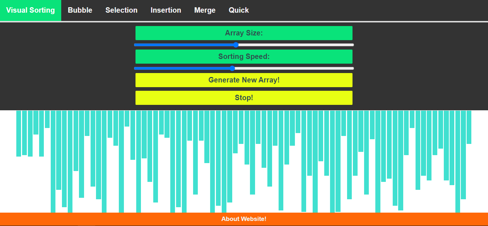

<h1 align="center">
    Sorting Visualizer
</h1>

## Responsive visualizer built using Vanila JavaScript for popular algorithms

<a href="https://sadanandpai.github.io/sorting-visualizer/dist/"></a>
[See it in action](https://dhruvit07.github.io/sorting/)

Welcome to Sorting Visualizer! I built this application because I was fascinated by sorting algorithms, 
and I wanted to visualize them in action. 
I hope that you enjoy playing around with this visualization tool just as much as I enjoyed building it. 

### This repo is an attempt to help in learning popular sorting algorithms by visualization

Helps to

- understand the working of sorting algorithm
- check total swaps required
- check total comparisions
- know the time taken (time is just an approximate unit for comparision)

Features

- Sort any given array of 3 digits positive integers
- Alter the speed of execution
- Start, pause and reset the execution
- Generate random array of numbers of sorting

### Technologies

- HTML5
- CSS3
- JavaScript

### Run in your local

- ```git clone https://github.com/Dhruvit07/sorting.git```
- ```open index.html``` (after navigating inside the directory)

### Contributing Guide

Currently we are not accepting any contribution, we'll update as soon as we do.
<br/>
